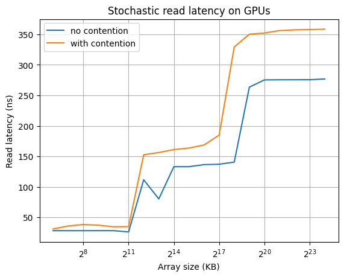

# gpu-performance-test
This repository contains the code to test GPU memory and branch penalty

### Branch penalty

The pseudocode for the benchmark is:
```cpp
// Generate a random array with a discrete distribution
bool random[32] = [1 with probability p else 0 ]
copy random to GPU
__global__ kernel (bool *random){
    int idx = (threadIdx.x + blockIdx.x * blockDim.x) % 32;
    if (idx) {
        do something
    } else {
        do the same thing with different parameters
    }
}
```
Note: Waps are assumed of size = 32.  

The CPU code generates an array `R` of 32 elements. Each element is 1 with probability p, 0 with probability 1-p (discrete distribution).  
Then this array is copied to the GPU. The GPU kernel computes  `idx = THREAD_ID % 32` and in case `R[idx]` is `1` does something otherwise executes a function that has the same number of PTX instructions.  
This causes the branch to diverge every time a 0 is encountered. 
  
The results shw that if even one warps diverges the performance halves.

### Memory latency
The pseudocode for the benchmark is:
```cpp
auto vector = [i for i in N]
vector.shuffle();
copy the vector to the GPU
__global__ kernel(uint64_t* vector) {
    int tid = (threadIdx.x + blockIdx.x * blockDim.x) % N;
    auto index = tid;
    for (i=0 to reads) {
        index = vector[index];
    }
}
```
The code starts by creating an array where array[i]=i and the shuffles it. Since the code was slow xoroshiro-cpp passed to the shuffling function. The array is generated using this method to avoid random number generation on the GPU which can pollute the results.
The array is then copied to the GPU.  
The kernel computed the tid and uses the tid to address one element of the array. Then it assigns `index = vector[index]` in a loop executed reads time.
Given how the array is constructed this causes uniform stochastic memory accesses. The kernel is executed read times to dilute the calling overhead that can pollute the results.
  
The results show that the when the array fits in cache the latency is `~30ns`. However, when the array does not fit in cache anymore it increases to `~170ns` and even `~300ns`. If memory contention (parallel accesses from multiple threads) is added, the latency can increase up to `~360ns`.


### Note: tests are executed on a NVIDIA RTX 3090ti and CUDA V11.8.89